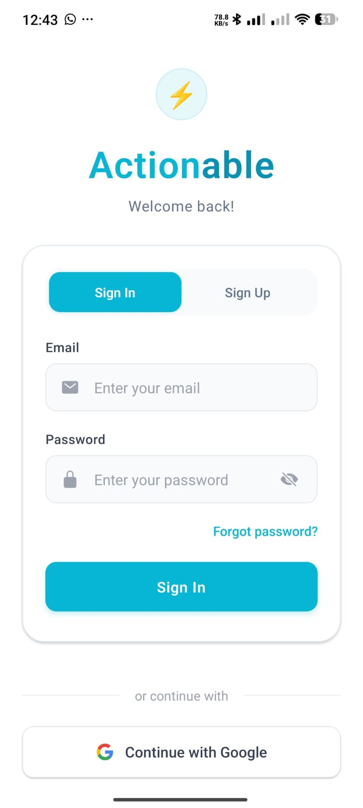
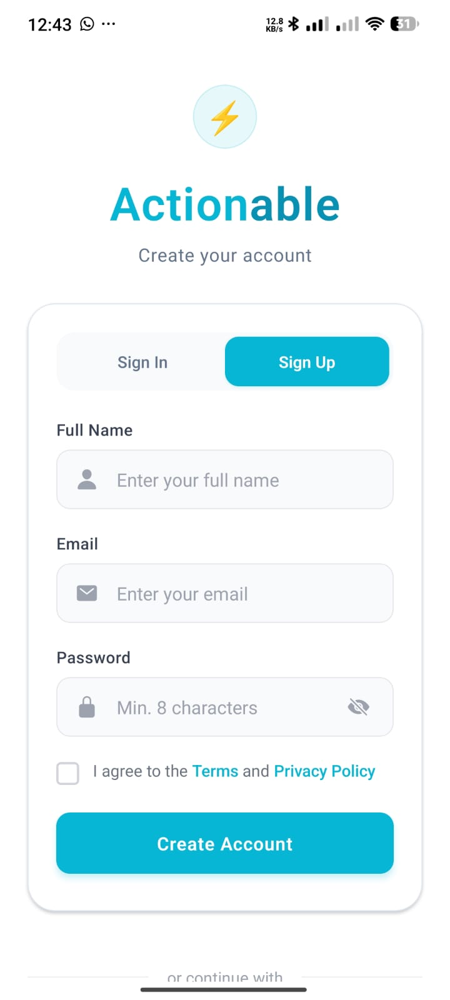
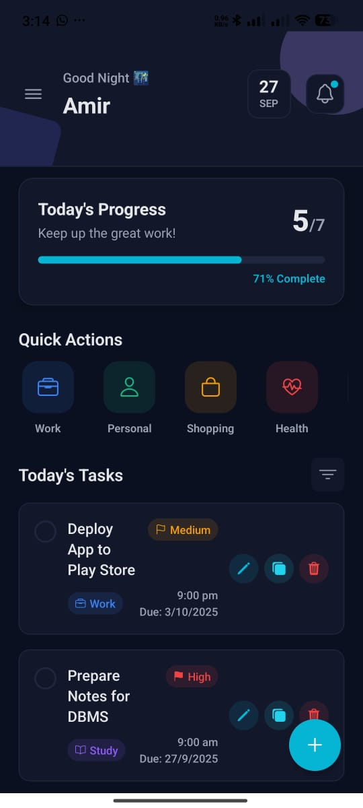

# Actionable - Task Tracker App 📱

A modern, cross-platform task management application built with React Native and Expo, featuring Supabase integration for real-time data synchronization.

## Features

- ✅ **Task Management**: Create, edit, delete, and organize tasks
- 🔐 **Authentication**: Secure user authentication with Supabase Auth
- 📱 **Cross-Platform**: Works on iOS, Android, and Web
- 🎨 **Modern UI**: Beautiful, responsive design with dark/light theme support
- 🔔 **Notifications**: Push notifications for task reminders
- 📊 **Progress Tracking**: Visual progress indicators and statistics
- 🔍 **Smart Filtering**: Filter tasks by category, priority, and status
- ☁️ **Real-time Sync**: Cloud synchronization across all devices

## Screenshots

### Mobile App Screenshots





### Dark Theme Screenshots





## Setup & Installation

### Prerequisites
- Node.js (v16 or higher)
- npm or yarn
- Expo CLI
- Supabase account

### Environment Setup

1. Clone the repository
   ```bash
   git clone https://github.com/amirphiladam2/Actionable.git
   cd Actionable
   ```

2. Install dependencies
   ```bash
   npm install
   # or
   yarn install
   ```

3. Create environment file
   ```bash
   cp .env.example .env
   ```
   
   Fill in your Supabase credentials in `.env`:
   ```
   SUPABASE_URL=your_supabase_project_url
   SUPABASE_ANON_KEY=your_supabase_anon_key
   ```

4. Start the development server
   ```bash
   npx expo start
   ```

In the output, you'll find options to open the app in a

- [development build](https://docs.expo.dev/develop/development-builds/introduction/)
- [Android emulator](https://docs.expo.dev/workflow/android-studio-emulator/)
- [iOS simulator](https://docs.expo.dev/workflow/ios-simulator/)
- [Expo Go](https://expo.dev/go), a limited sandbox for trying out app development with Expo

You can start developing by editing the files inside the **app** directory. This project uses [file-based routing](https://docs.expo.dev/router/introduction).

## Get a fresh project

When you're ready, run:

```bash
npm run reset-project
```

This command will move the starter code to the **app-example** directory and create a blank **app** directory where you can start developing.

## Learn more

To learn more about developing your project with Expo, look at the following resources:

- [Expo documentation](https://docs.expo.dev/): Learn fundamentals, or go into advanced topics with our [guides](https://docs.expo.dev/guides).
- [Learn Expo tutorial](https://docs.expo.dev/tutorial/introduction/): Follow a step-by-step tutorial where you'll create a project that runs on Android, iOS, and the web.

## Join the community

Join our community of developers creating universal apps.

- [Expo on GitHub](https://github.com/expo/expo): View our open source platform and contribute.
- [Discord community](https://chat.expo.dev): Chat with Expo users and ask questions.
